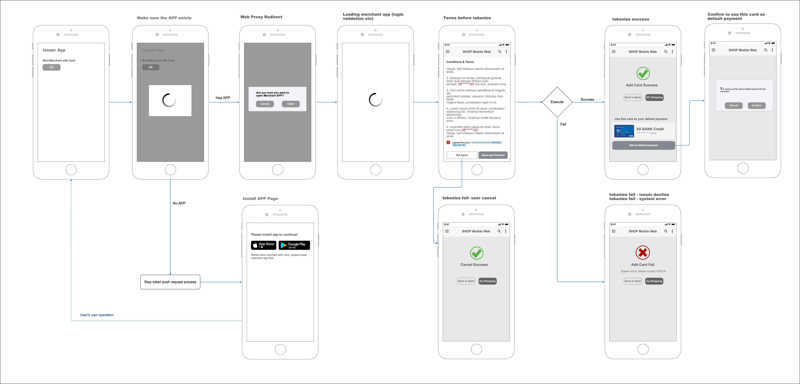

Tappay Push Token Sample
==========================

  - [Flow](#flow)
  - [Flow description](#flow-description)
  - [Getting Started](#getting-started)
<br>
<br>

## Flow
  
<br>
<br>

## Flow description
1. Make sure issuer app has been installed
2. Setup up App schema in AndroidManifest.xml
3. Issuer App will launch your App with **tspPushToken** and **cancelUrl**
4. Parse **TspPushToken** and **cancelUrl** from intent data
5. Send <a href="https://docs.tappaysdk.com/tutorial/zh/advanced.html#push-token-api" target="_blank">Push Token API</a>  to Tappay server 
6. You will get a suceess response with cardKey and cardToken
7. You may get more card information by <a href="https://docs.tappaysdk.com/tutorial/zh/advanced.html#card-metadata-api" target="_blank">Card Metadata API</a> if you want
<br>
<br>

## Getting Started  
<br>

Setup App schema in AndroidManifest.xml

```xml
<activity
        android:name="tech.cherri.tokenpushexample.MainActivity"
        android:exported="true">

        <intent-filter>
            <action android:name="android.intent.action.VIEW" />
            <category android:name="android.intent.category.DEFAULT" />
            <category android:name="android.intent.category.BROWSABLE" >
            <data
                android:host="mock.merchant.app"
                android:scheme="cherri" />
        </intent-filter>
 </activity>        
```

Fill in partner_key in string.xml

```java
// string.xml
<string name="partner_key">your partner key</string>
```
<br>

TokenPushTask.java will show you how to send a HTTP POST request to TapPay 

```java

...

// JSON request
JSONObject jsonRequest = new JSONObject();
try {
    jsonRequest.put("partner_key", partnerKey);
    jsonRequest.put("tsp_push_token", tokenPushParam.getTspToken());
} catch (JSONException e) {
    Log.e(TAG, "init TokenPushTask error: " + Log.getStackTraceString(e));
}

// onPostExecute , Register a callback if you need to Show Add Card Result in your UI component (MainActivity here)

tokenPushParam.getTokenPushCallback().getTaskResult(jsonObject);
    
```

